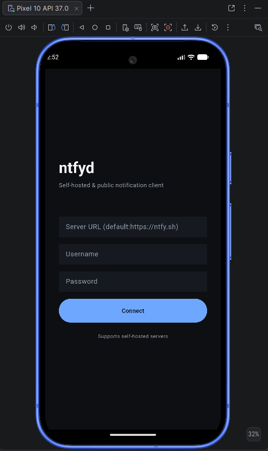

# ntfyd

A Flutter client for [ntfy](https://ntfy.sh) — supports ntfy.sh and self-hosted instances.

## Architecture
Clean Architecture · Bloc/Cubit · Drift · Hybrid delivery (FCM + Foreground Service)

## Getting Started
```bash
flutter pub get
flutter run
```

## Milestone 1 UTS Mobile Computing


[View Figma Project](https://www.figma.com/design/w5ReqplnrVOWVD2LZg1egU/ntfyd?node-id=6-2&p=f&t=cTwifG3Nl0FwnO8n-0)


### Authentication Model
This application does not implement its own user authentication or account system. Instead, it follows the ntfy architecture, where authentication and authorization are handled by the configured ntfy-compatible server.

### Validation Model
When client LogIn using LoginPage server is added or updated, the application validates the server configuration by performing a health check against the configured server URL.

The health check is used only to verify that:
- The server is reachable.
- The server is operational.
- The URL is valid and compatible with the application.

The application does not authenticate users during this step and does not maintain application-level sessions.

### Authentication and Authorization
Authentication occurs only when interacting with server resources (in ntfy case is called topic) that require credentials. The configured server is responsible for validating credentials and enforcing access permissions for topics and other protected resources.